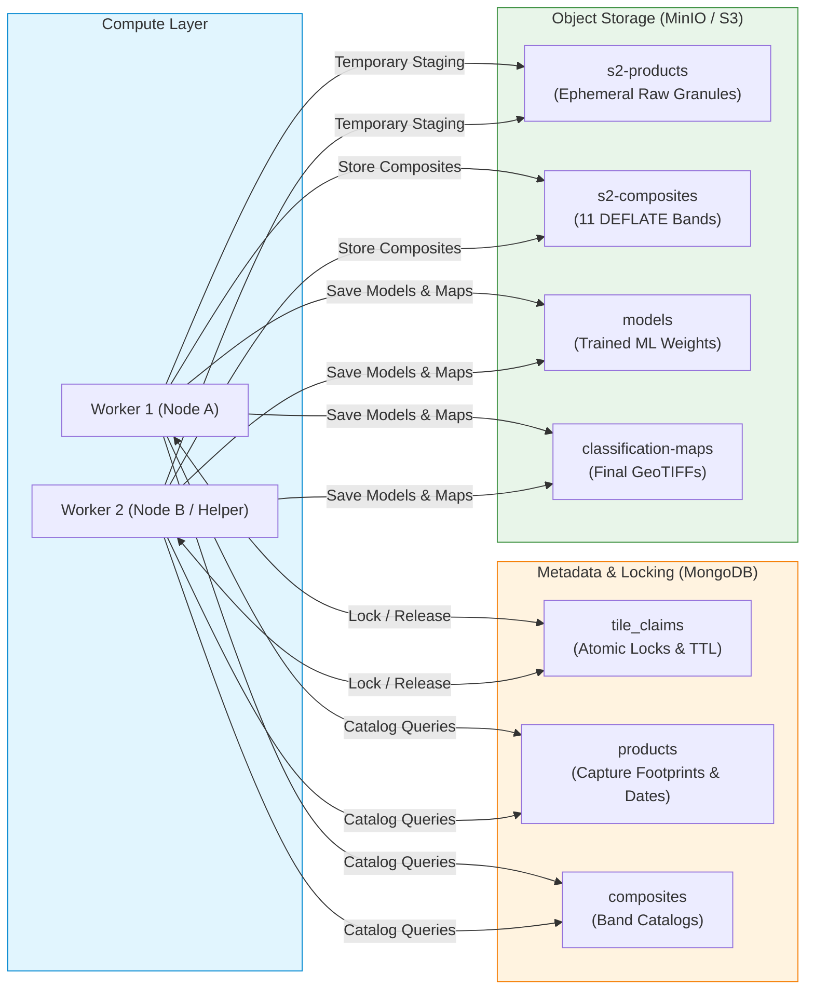
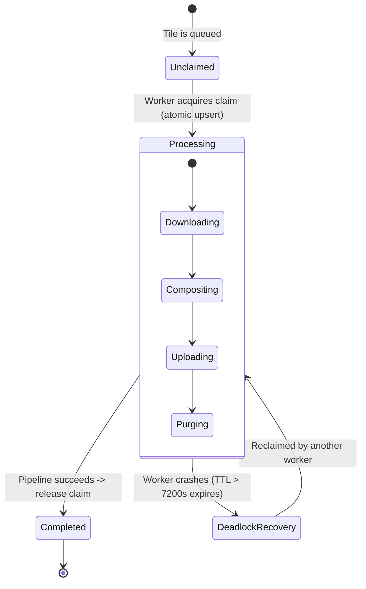
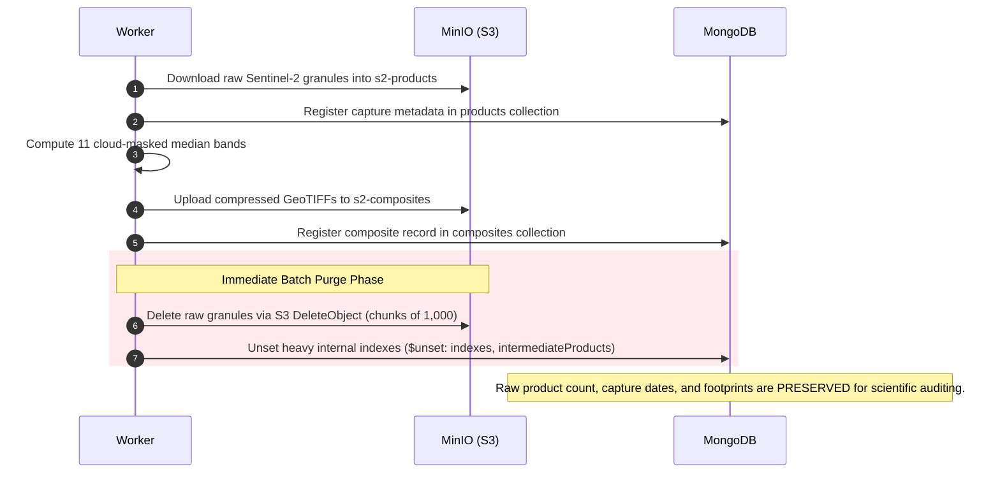

# Architecture: Systems, Concurrency & Storage Lifecycle

This document describes the underlying software architecture, distributed synchronization mechanisms, and storage optimization strategies in **LandCoverPy**.

---

## 1. System Topology

LandCoverPy separates computation from storage to support large-scale distributed deployments.

---

## 2. Distributed Synchronization: Atomic Tile Claims

When scaling to hundreds of tiles across multiple physical machines or virtual workers, workers coordinate via MongoDB's `tile_claims` collection to prevent redundant downloads and race conditions:

### Claim Logic Details
1. **Atomic Upsert:** A worker queries `tile_claims` for `{tile: X, season: Y}`. If the record doesn't exist or is older than the Time-To-Live (TTL = 2 hours), the worker atomically updates the document with its `worker_id` and timestamps.
2. **Crash Recovery (TTL):** If a worker runs out of memory or crashes mid-tile, other workers can safely reclaim the tile after 7,200 seconds without manual intervention.
3. **Multi-Worker Strategies:**
   - **Forward & Reverse:** Node A processes alphabetically ($A \rightarrow Z$); Node B processes in reverse ($Z \rightarrow A$ with `REVERSE_TILES=true`). When they meet in the middle, claims prevent duplicate work.
   - **Worker Partitioning:** `process_composites_and_cleanup.py` supports deterministic modulo sharding via `--num-workers N --worker-id I`.

---

## 3. Storage Optimization & Automatic Purge Lifecycle

Processing 540 tiles across 4 seasons generates terabytes of intermediate satellite data. LandCoverPy implements a strict storage lifecycle to run reliably on limited disk:

### Key Technical Implementations:
- **Batch S3 Deletion:** Objects are removed using MinIO's `remove_objects` with `DeleteObject` in batches of 1,000, avoiding thousands of individual HTTP requests.
- **Preserved Metadata:** `$unset` removes bulky pixel metadata arrays in Mongo while leaving the core product records (footprint polygon, capture date, tile ID) intact. This enables paper-level spatial audits without retaining raw raster files.
- **GeoTIFF Compression & Horizontal Predictor:** Composite bands and final maps are written with DEFLATE compression:
  - `predictor=3` for floating-point raster arrays (spectral indices).
  - `predictor=2` for integer arrays (reflectance bands and class masks).
  - This reduces disk footprint by **$\sim 45\text{–}60\%$** compared to standard GeoTIFFs.

---

## 4. Low-Level Resource Management

- **GDAL Cache Control:** `GDAL_CACHEMAX=512` caps the internal block cache to prevent unconstrained memory growth during windowed raster slicing.
- **Connection Recycling:** To prevent socket exhaustion (`FIN_WAIT`) in environments like Docker on WSL2, workers automatically recycle their HTTP session pools via exponential backoff and `_reset_global_session`.
