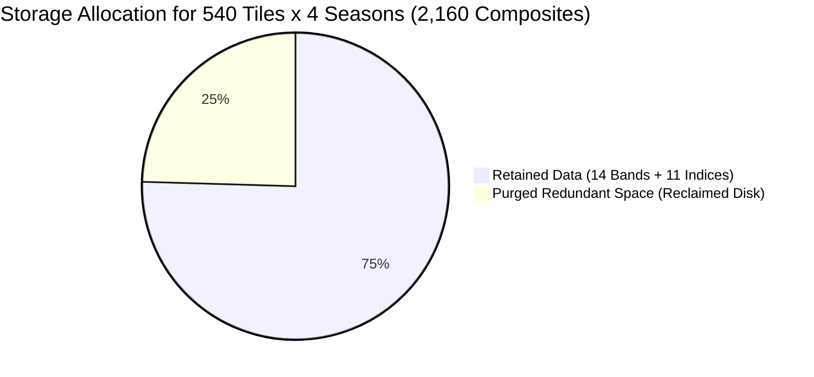

# Spectral Bands and Biophysical Indices: Specification & Optimization Criteria

This document details the scientific and technical specification of the Sentinel-2 L2A spectral bands and biophysical vegetation indices used in **LandCoverPy**, including the rationalization criteria applied to save over 2.8 TB of storage while maintaining maximum classification accuracy.

---

## 1. Stored Spectral Bands (14 Bands in `/raw/`)

LandCoverPy's Machine Learning models (Random Forest) do not rely solely on derived indices; they **learn directly from physical Bottom-Of-Atmosphere (BOA) surface reflectance values**.

Each seasonal composite stores **14 spectral band rasters**: the **12 native physical bands** of Sentinel-2 L2A plus **2 auxiliary resolution resamplings** (`B03_20m` and `B05_60m`) required for matrix operations in NumPy:

| Band | Central Wavelength ($\text{nm}$) | Spatial Resolution | Spectral Name | Biophysical & Ecological Relevance |
| :--- | :---: | :---: | :--- | :--- |
| **`B01_60m`** | $443\text{ nm}$ | $60\text{ m}$ | Coastal Aerosol | Atmospheric baseline; aerosol scattering correction. |
| **`B02_10m`** | $490\text{ nm}$ | $10\text{ m}$ | Blue | Carotenoid and chlorophyll absorption; soil vs. vegetation separation. |
| **`B03_10m`** | $560\text{ nm}$ | $10\text{ m}$ | Green | Peak canopy reflectance; open water discrimination. |
| **`B04_10m`** | $665\text{ nm}$ | $10\text{ m}$ | Red | Maximum chlorophyll absorption; core photosynthetically active radiation band. |
| **`B05_20m`** | $705\text{ nm}$ | $20\text{ m}$ | Red Edge 1 (RE1) | Chlorophyll absorption boundary; sensitive to early canopy stress. |
| **`B06_20m`** | $740\text{ nm}$ | $20\text{ m}$ | Red Edge 2 (RE2) | Rapid transition to cellular scattering; leaf nitrogen content. |
| **`B07_20m`** | $783\text{ nm}$ | $20\text{ m}$ | Red Edge 3 (RE3) | Leaf mesophyll cellular structure and accumulated biomass. |
| **`B08_10m`** | $842\text{ nm}$ | $10\text{ m}$ | NIR (Broad) | Maximum cellular leaf scattering; core band for vegetation vigor. |
| **`B8A_20m`** | $865\text{ nm}$ | $20\text{ m}$ | Narrow NIR | Atmospheric-water-absorption-free NIR; precise canopy calibration. |
| **`B09_60m`** | $945\text{ nm}$ | $60\text{ m}$ | Water Vapour | Atmospheric water vapor absorption; used in NDRE index calculation. |
| **`B11_20m`** | $1610\text{ nm}$ | $20\text{ m}$ | SWIR 1 | Foliar water content and canopy moisture stress; rock/soil differentiation. |
| **`B12_20m`** | $2190\text{ nm}$ | $20\text{ m}$ | SWIR 2 | Lignocellulose absorption; dry plant matter (summer senescence) vs. bare ground. |
| **`B03_20m`** | $560\text{ nm}$ | $20\text{ m}$ | Green (Auxiliary) | 20m resampled copy; allows direct array subtraction with `B11_20m` for `MNDWI`. |
| **`B05_60m`** | $705\text{ nm}$ | $60\text{ m}$ | Red Edge 1 (Auxiliary) | 60m resampled copy; allows direct array operations with `B09_60m` for `NDRE`. |

<details>
<summary><b>🔍 Why can raw Sentinel-2 products contain up to 24 band files, and why are they filtered?</b></summary>

The European Space Agency's official Level-2A processor (**Sen2Cor**) packages scenes with downsampled duplicates of bands at multiple spatial resolutions, resulting in up to 24 raster files per granule:
- **10m native bands:** Packaged in triplicate (`R10m`, `R20m`, and `R60m`).
- **20m native bands:** Packaged in duplicate (`R20m` and `R60m`).
- **Atmospheric non-reflectance layers:** `AOT` (Aerosol Optical Thickness) and `WVP` (Water Vapour Percentage) generated at 10m, 20m, and 60m.

**Filtering rationale:**  
Storing every duplicate downsampled band creates massive redundancy. LandCoverPy:
1. Always preserves physical bands at their **highest native resolution** (12 bands).
2. Keeps only the **2 auxiliary resolutions** (`B03_20m` and `B05_60m`) strictly necessary so NumPy can evaluate index formulas without dimension mismatch exceptions (`ValueError: operands could not be broadcast together`).
3. Excludes `AOT` and `WVP` layers entirely, as they measure atmospheric column properties rather than ground surface land cover.
</details>

---

## 2. Calculated Biophysical Indices (11 Indices in `/indexes/`)

From the composite spectral bands, the pipeline calculates **11 normalized biophysical indices** capturing non-linear vegetation, moisture, and soil dynamics:

| Index | Resolution | Mathematical Formula | Scientific & Ecological Relevance |
| :--- | :---: | :---: | :--- |
| **`ndvi`** | $10\text{ m}$ | $\frac{B08 - B04}{B08 + B04}$ | **Photosynthetic vigor:** Core measure of green biomass and basic seasonal phenology. |
| **`evi2`** | $10\text{ m}$ | $2.5 \cdot \frac{B08 - B04}{B08 + 2.4 \cdot B04 + 1.0}$ | **Dense canopy without atmospheric noise:** Two-band enhanced vegetation index; avoids saturation in closed canopies. |
| **`osavi`** | $10\text{ m}$ | $\frac{B08 - B04}{B08 + B04 + 0.16}$ | **Soil background adjustment:** Optimizes vegetation signals in open dehesas, sparse shrublands, and pastures. |
| **`ri`** | $10\text{ m}$ | $\frac{B04 - B03}{B04 + B03}$ | **Redness Index:** Detects soil hematite/iron oxides and foliage undergoing autumn senescence. |
| **`cri1`** | $10\text{ m}$ | $\frac{1}{B02} - \frac{1}{B03}$ | **Carotenoids:** Reflects plant stress, photoinhibition, and carotenoid-to-chlorophyll ratios. |
| **`ndyi`** | $10\text{ m}$ | $\frac{B02 - B03}{B02 + B03}$ | **Yellowing Index:** Crucial for detecting spring flowering events (May) and summer drying. |
| **`mndwi`** | $20\text{ m}$ | $\frac{B03 - B11}{B03 + B11}$ | **Water bodies:** Sharp delimitation of lakes, reservoirs, and wetlands while suppressing urban/soil false positives. |
| **`moisture`**| $20\text{ m}$ | $\frac{B8A - B11}{B8A + B11}$ | **Canopy moisture stress:** High-resolution leaf water content from narrow NIR and SWIR1. |
| **`ndre`** | $60\text{ m}$ | $\frac{B09 - B05}{B09 + B05}$ | **Chlorophyll saturation:** Red Edge to water vapor ratio for dense forest stands. |
| **`bsi`** | $10\text{ m}$ | $\frac{(B11 + B04) - (B08 + B02)}{(B11 + B04) + (B08 + B02)}$ | **Bare Soil Index:** Critical for soil erosion, desertification gradients, and wildfire burn scars in the Mediterranean. |
| **`bri`** | $10\text{ m}$ | $\frac{B03 - B05}{B08}$ | **Biological Ripening Index:** Characterizes lignification, wood content, and dry biomass in Mediterranean sclerophyllous forests. |

---

## 3. Discarded Indices: Scientific & Storage Justification (4 Elements)

Computing all conceivable spectral indices generates up to 15 index rasters per tile-season. Following methodological analysis, **4 elements were eliminated**, saving **$> 1.27\text{ GB}$ per composite**:

<details open>
<summary><b>📦 Discarded Indices Breakdown & Technical Rationale</b></summary>

| Discarded Feature | Spatial Res. | Size per Composite | Why It is Excluded in Code & Remote Sensing |
| :--- | :---: | :---: | :--- |
| **`evi`** *(Enhanced Veg. Index)* | $10\text{ m}$ | $\sim 395\text{ MB}$ | **Subsumed by `evi2`:** Classic EVI uses the Blue band (`B02`), which suffers significant Rayleigh scattering and residual aerosol contamination. EVI2 (Jiang et al., 2008) achieves identical biophysical sensitivity without using the Blue band. Retaining both doubled storage for redundant information. |
| **`tci`** *(True Color Image)* | $10\text{ m}$ | $\sim 498\text{ MB}$ | **Visual RGB rendering, not an analytical index:** TCI is a standard natural-color 8-bit image ($uint8$, values 0–255) intended purely for human inspection in web viewers. The ML classifier never consumes it, and the pipeline explicitly excludes it via `skip_bands = ["tci", "scl"]`. |
| **`ndwi`** *(Norm. Diff. Water Index)* | $10\text{ m}$ | $\sim 378\text{ MB}$ | **Replaced by `mndwi`:** Classic NDWI (McFeeters, Green/NIR) produces severe false positives over arid bare soils and built-up urban surfaces. MNDWI (Xu, Green/SWIR1) effectively suppresses these surfaces, making classic NDWI obsolete. |
| **`ndsi`** *(Norm. Diff. Snow Index)* | $20\text{ m}$ | $\sim 95\text{ MB}$ | **Irrelevant to Mediterranean annual vegetation phenology:** Designed to distinguish snow and ice. In Mediterranean land cover and forest species classification, winter snow is an ephemeral event that does not represent a target vegetation class. |

</details>

---

## 4. Overall Storage Impact (540 Tiles $\times$ 4 Seasons)

By preserving the 14 essential spectral bands and 11 biophysical indices (instead of the uncurated 24 bands and 15 indices):



- **Uncurated footprint:** $2,160 \times 5.3\text{ GB} \approx \mathbf{11.45\text{ TB}}$ *(Exceeds a standard 10 TB physical disk)*.
- **Optimized footprint:** $2,160 \times 4.0\text{ GB} \approx \mathbf{8.64\text{ TB}}$ *(Fits comfortably with $> 1.2\text{ TB}$ safety margin)*.
- **Retroactive cleanup tool:** To purge legacy discarded indices from earlier runs, run:
  ```bash
  python demo_deployment/purge_discarded_indexes.py
  ```
