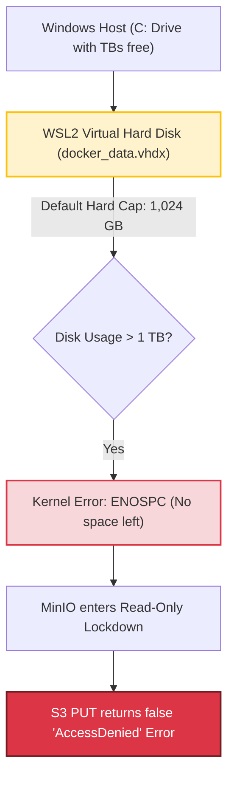

# Technical Recommendations, System Requirements & Troubleshooting

This document outlines the hardware requirements, operating system considerations, and operational troubleshooting procedures for deploying **LandCoverPy** in production or large-scale research environments.

---

## 1. Hardware & Infrastructure Sizing

Processing high-resolution satellite imagery across large geographic domains (such as the 540 Sentinel-2 tiles of the Mediterranean Basin) demands adequate memory and storage provisioning.

### Recommended System Specifications

| Component | Minimum (Test / Few Tiles) | Recommended (Continental Scale / Production) | Operational Note |
| :--- | :--- | :--- | :--- |
| **RAM** | $16\text{ GB}$ | $32\text{ GB} - 64\text{ GB}$ | Each MGRS tile is $10,980 \times 10,980$ pixels at $10\text{ m}$. NumPy array operations require memory headroom during multi-spectral compositing. |
| **CPU** | 4 Cores | 8 – 16 Cores | Multi-threaded GDAL raster re-projection, decompression, and Random Forest feature training. |
| **Storage (Persistent)** | $100\text{ GB}$ SSD | $\ge 10\text{ TB}$ NVMe / Fast HDD | Holds the final 14 bands and 11 biophysical indices across 4 seasons ($8.64\text{ TB}$ net) with safety margin. |
| **Network** | $50\text{ Mbps}$ | $\ge 300\text{ Mbps}$ | High-throughput connection to Google Cloud Sentinel-2 public buckets. |

---

## 2. Operating System Considerations

### Linux Native (Ubuntu / Debian / RHEL) — *Recommended*
Deploying on bare-metal Linux or standard cloud Linux VMs provides the highest I/O throughput and simplest filesystem management, as Docker interacts directly with the host kernel without virtualization translation layers.

### Windows Host with Docker Desktop (WSL2) — *Known Pitfalls & Mitigations*

While convenient for local development, running multi-terabyte pipelines under Docker Desktop on Windows requires specific precautions:



#### Issue 1: The 1 TB Virtual Disk Cap (`docker_data.vhdx`)
- **Symptom:** Satellite downloads or composite uploads abruptly fail with `minio.error.S3Error: AccessDenied`, even though your Windows host drive still has several terabytes free.
- **Root Cause:** By default, Microsoft WSL2 caps dynamic `.vhdx` virtual disks at $1,024\text{ GB}$ (1 TB). When Docker exhausts this virtual space, the kernel triggers `ENOSPC`. To prevent filesystem corruption, MinIO automatically switches to a read-only lockdown mode, rejecting all incoming `PUT` requests with an `AccessDenied` error.
- **Solution (Expanding `.vhdx` via Diskpart):**
  1. Terminate all WSL2 instances from Windows PowerShell (Run as Administrator):
     ```powershell
     wsl --shutdown
     ```
  2. Open the Windows disk partition utility:
     ```powershell
     diskpart
     ```
  3. Select and expand your Docker virtual disk file:
     ```cmd
     select vdisk file="C:\Users\<YOUR_USER>\AppData\Local\Docker\wsl\disk\docker_data.vhdx"
     expand vdisk maximum=3145728
     exit
     ```
     *(Note: `3145728` expands the virtual boundary to 3 TB. Adjust according to your physical disk capacity).*

#### Issue 2: WSL2 Host Memory Starvation
Without limits, WSL2 can consume up to 80% of total host RAM, leaving Windows unresponsive during heavy raster jobs.
- **Mitigation:** Create or edit `%USERPROFILE%\.wslconfig` in Windows:
  ```ini
  [wsl2]
  memory=28GB       # Adjust according to physical RAM (e.g. 28GB on a 32GB machine)
  processors=8      # Limit vCPUs allocated to WSL2
  swap=8GB          # Provide moderate swap
  ```

---

## 3. Container & Performance Tuning

### 1. GDAL Block Cache (`GDAL_CACHEMAX`)
Raster operations read and write pixel blocks concurrently. Unrestricted caching can cause sudden container Out-Of-Memory (OOM) kills.
- **Setting:** `GDAL_CACHEMAX=512` (or `1024` on high-memory nodes).
- Configured as an environment variable in `docker-compose.yaml` to ensure rasterio/GDAL operations flush blocks deterministically.

### 2. Docker Log Rotation
Long-running batch jobs generate millions of log lines over days of continuous operation. Without rotation, Docker's default JSON logs can quietly consume hundreds of gigabytes of disk space.
- **Recommended Docker Compose log configuration:**
  ```yaml
  logging:
    driver: "json-file"
    options:
      max-size: "50m"
      max-file: "3"
  ```

### 3. Socket Pool Recycling & Connection Resiliency
When running multiple distributed workers querying MongoDB and MinIO continuously, high connection turnover can cause ephemeral port exhaustion (`TIME_WAIT` / `FIN_WAIT`).
- **Mitigation in Code:** The pipeline includes built-in exponential backoff retries and connection pool cycling (`_reset_global_session`) to smoothly recover from transient network drops without terminating the job.

---

## 4. Multi-Node Deployment Recommendations

For large-scale processing across heterogeneous machines:
1. **Dedicated Storage Host:** Run `minio` and `mongo` on the machine with the largest fast SSD/NVMe volume.
2. **Stateless Compute Nodes:** Launch compute worker containers on other nodes, pointing `MINIO_HOST` and `MONGO_HOST` to the storage host IP.
3. **Directional Processing:** Use forward alphabetical iteration ($A \rightarrow Z$) on the primary worker, and inverse iteration ($Z \rightarrow A$ with `REVERSE_TILES=true`) on the secondary worker. The atomic locking mechanism (`tile_claims`) automatically handles crossover in the middle.
