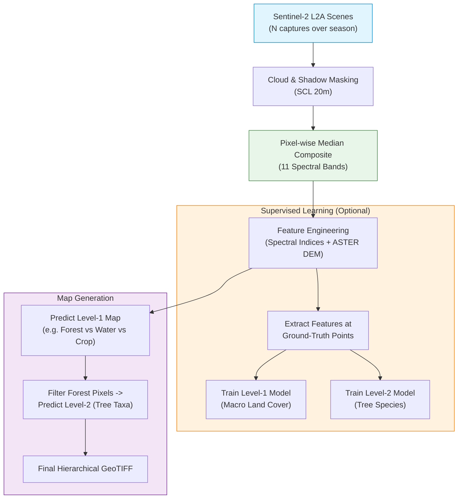
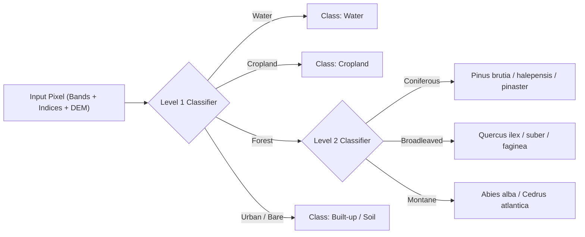

# Workflow: Conceptual & Methodological Pipeline

**LandCoverPy** transforms multi-temporal satellite imagery (Sentinel-2) and digital elevation models (ASTER GDEM) into high-resolution thematic land cover and tree-species maps through hierarchical machine learning.

To understand the workflow clearly, this document explains the process on **a single tile and a single seasonal window**, followed by how it scales to continental regions.

---

## 1. Pipeline Overview 

---

## 2. Step-by-Step Methodology

### Step 1: Satellite Scene Selection
For a given Sentinel-2 tile (e.g., `30SXJ`) and time window (e.g., Spring: March 1 – April 30):
- The pipeline queries Google Cloud for all available **Sentinel-2 L2A** granules (Bottom-Of-Atmosphere reflectance).
- Scenes with too much cloud coverage or insufficient data are discarded based on `MIN_USEFUL_DATA_PERCENTAGE`.
- Up to `MAX_PRODUCTS_COMPOSITE` (typically 4–5) best captures are retained.

### Step 2: Cloud & Shadow Masking
Individual satellite passes often contain clouds, cirrus, and cloud shadows that distort surface reflectance:
- The **Scene Classification Layer (SCL)** generated by Sen2Cor is inspected per pixel.
- Pixels classified as clouds, cirrus, cloud shadows, or snow are masked out (set to NoData).

### Step 3: Temporal Median Composite
To produce a single, cloud-free, seamless image representing the season:
- For every pixel across the valid captures, the **median reflectance value** is computed for each spectral band.
- **Why median instead of mean?** The median naturally ignores residual cloud edges or momentary sensor anomalies without blurring sharp land boundaries.
- The result is a clean **seasonal composite** comprising 11 key spectral bands.

### Step 4: Feature Engineering (Indices + Topography)
To distinguish between vegetation types that appear similar in raw bands:
- **Spectral Indices:** Normalized ratios such as NDVI (vegetation vigor), NDRE (canopy chlorophyll), MNDWI (water content), and NDSI (snow/soil) are derived.
- **Topography:** Elevation, slope, and aspect from **ASTER GDEM** are aligned to the tile grid. Topography strongly governs Mediterranean microclimates and vegetation distribution (e.g., *Abies alba* at high altitudes vs. *Pinus halepensis* in dry lowlands).

### Step 5: Hierarchical Classification
Instead of training a single classifier on 30+ fine-grained classes (which causes severe confusion between similar spectral signatures), LandCoverPy splits the problem into two stages:

1. **Level 1 (Macro Land Cover):** Classifies the entire tile into general categories (Forest, Shrubland, Cropland, Water, Wetland, Urban, Grassland, Bare Soil).
2. **Level 2 (Taxonomic Specialization):** Applied **only to pixels classified as Forest**. Identifies specific tree species (*Pinus*, *Quercus*, *Eucalyptus*, *Olea*, etc.) using the full seasonal spectral trajectory.

---

## 3. Scaling to Multiple Seasons and Large Regions

While the logic above operates on 1 tile and 1 season, full vegetation mapping scales across two dimensions:

1. **Multi-Seasonal Phenology:**
   Deciduous trees lose leaves in autumn; crops are harvested in summer; flowering occurs in May. Combining composites from **4 distinct seasons** (Spring, Flowering, Summer, Autumn) provides a 4-dimensional temporal profile that makes species separation highly accurate.

2. **Geographic Coverage (Tiles):**
   A continental study (such as the Mediterranean Basin) consists of **540 tiles**. Each tile is processed independently through this pipeline, allowing seamless parallelization across multi-core machines or distributed cluster workers.

---
