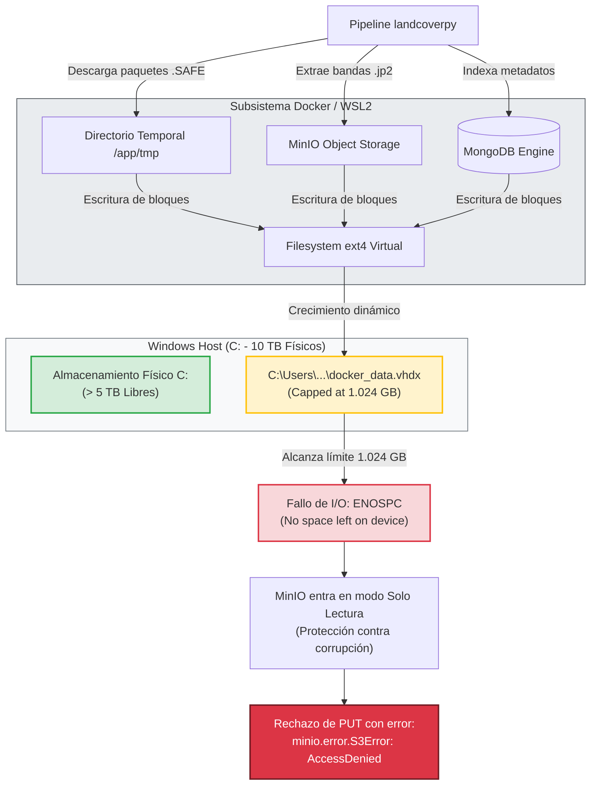
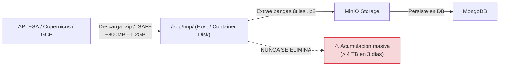

# Incidente y Runbook: Resolución de Cuello de Botella de Almacenamiento en Docker Desktop (WSL2)

> **Documento de Operaciones y RCA (Root Cause Analysis)**  
> **Afecta a:** Pipeline de ingestión y procesamiento satelital (`landcoverpy` / `ds-download`)  
> **Entorno:** Servidor de Cómputo / Producción (Windows Host + Docker Desktop WSL2 Backend)  
> **Estado:** Resuelto (Mitigación de infraestructura aplicada; deuda técnica de software identificada)

---

## 1. Resumen Ejecutivo y Síntomas

Durante la ejecución masiva del pipeline para el procesamiento de más de 50.000 registros satelitales del Mediterráneo, el sistema experimentó colapsos críticos tras horas de ejecución aparentemente estable.

### Síntomas Observados
* **Fallo silencioso en descargas:** La extracción de productos satelitales Sentinel-2 se detenía abruptamente sin errores previos de red.
* **Error de MinIO:** Trazas repetitivas en los logs arrojando:
  ```text
  minio.error.S3Error: S3 operation failed; code: AccessDenied, message: Access Denied.
  ```
* **Discrepancia de consistencia en datos:** MongoDB registraba metadatos de imágenes que en el almacenamiento de MinIO quedaban corruptas, a 0 bytes o truncadas.
* **Falsa sensación de capacidad en el host:** El disco físico anfitrión (`C:\`) mostraba más de 5 TB libres de sus 10 TB totales, enmascarando el agotamiento real de almacenamiento subyacente.

---

## 2. Análisis de Causa Raíz (RCA)

### 2.1. El Techo Oculto de WSL2 (`docker_data.vhdx`)
Docker Desktop en Windows utiliza por defecto una máquina virtual ligera sobre **WSL2** (Windows Subsystem for Linux). Los volúmenes de Docker, capas de contenedores, datos de MongoDB y logs se encapsulan en un único archivo de disco virtual dinámico:

$$\text{Ruta por defecto: } \texttt{C:\textbackslash Users\textbackslash<usuario>\textbackslash AppData\textbackslash Local\textbackslash Docker\textbackslash wsl\textbackslash disk\textbackslash docker\_data.vhdx}$$

Por especificación de Microsoft, este archivo `.vhdx` se crea con un **límite de crecimiento virtual de 1.024 GB (1 TB)** (o 256 GB en versiones anteriores). Aunque el disco físico tenga 10 TB libres, el subsistema de Docker es incapaz de sobrepasar ese umbral si no se redimensiona explícitamente.

### 2.2. La Trampa del Error `AccessDenied` (Falso Positivo de Credenciales)
El error que despistó diagnósticos previos (`AccessDenied`) **no era un problema de autenticación ni de políticas IAM**.



> [!IMPORTANT]
> **Mecanismo de seguridad de MinIO:** Cuando el sistema de archivos subyacente devuelve un error del kernel `ENOSPC` (*No space left on device*), MinIO pasa inmediatamente a modo de protección de solo lectura (*read-only lockdown*). Cualquier petición `PUT` posterior es rechazada con `AccessDenied`, induciendo a pensar que han caducado las credenciales cuando en realidad el disco virtual está lleno al 100%.

---

## 3. Runbook: Procedimiento de Expansión del Disco Virtual

Para desbloquear el procesamiento masivo, se amplió el disco virtual a **3 TB** utilizando la herramienta nativa `diskpart` de Windows.

### Requisitos Previos
* Acceso con privilegios de **Administrador** en el servidor de ejecución.
* Docker Desktop cerrado y subsistema WSL detenido para liberar bloqueos de fichero (`file locks`).

### Paso 1: Detención completa de WSL2
Desde PowerShell o CMD:
```powershell
wsl --shutdown
```

### Paso 2: Ejecución de `diskpart`
Abre una consola de PowerShell como **Administrador** y arranca la utilidad interactiva:
```powershell
diskpart
```

### Paso 3: Selección del volumen VHDX de Docker
Introduce la ruta exacta del disco virtual (ajustar la ruta según el usuario del servidor, p. ej. `khaosdev`):
```cmd
select vdisk file="C:\Users\khaosdev\AppData\Local\Docker\wsl\disk\docker_data.vhdx"
```

### Paso 4: (Opcional) Inspección del estado actual
Para comprobar el límite virtual anterior antes de modificarlo:
```cmd
detail vdisk
```

### Paso 5: Expansión del límite de almacenamiento
Se incrementa el techo a 3.000.000 MB (~3 TB):
```cmd
expand vdisk maximum=3000000
```
> [!NOTE]
> `maximum` se especifica en Megabytes (MB). $3.000.000\text{ MB} \approx 2{,}86\text{ TiB}$.

### Paso 6: Salida y reanudación del servicio
```cmd
exit
```
Inicia nuevamente **Docker Desktop**.

> [!TIP]
> **Auto-redimensionamiento en Docker Desktop moderno:** En las versiones recientes de Docker Desktop sobre WSL2, no es necesario entrar a la distribución Linux a ejecutar manualmente `resize2fs` ni `growpart`. Al levantar el servicio tras la expansión en `diskpart`, el demonio de Docker redimensiona automáticamente el sistema de ficheros `ext4`.

### Paso 7: Verificación del nuevo límite
Puedes verificar desde el propio host ejecutando un contenedor de prueba o inspeccionando el espacio disponible:
```powershell
docker run --rm alpine df -h /
```
La salida debe reflejar un tamaño total cercano a los `2.8T` - `3.0T`.

---

## 4. Deuda Técnica Crítica Identificada (Próximos Pasos en Software)

Aunque la ampliación a 3 TB ha estabilizado la ejecución en curso, la causa raíz del consumo excesivo es una **deuda técnica en el código de descarga (`ds-download` / `landcoverpy`)**.

### El Problema del Fuga de Almacenamiento


1. **Retención indefinida de `.SAFE`:** El pipeline descarga los productos completos de Sentinel-2 a un directorio temporal (`/app/tmp/`).
2. **Extracción sin limpieza:** Tras procesar y subir las bandas requeridas a MinIO, el paquete `.SAFE` original y sus directorios temporales **no son eliminados**.
3. **Consumo descontrolado:** Para 52.819 muestras con múltiples tiles y estaciones, el volumen de temporales desborda incluso un disco de varios Terabytes en pocos días.

### Plan de Acción Inmediato (Refactorización Python)
* [ ] Implementar un bloque de limpieza `finally:` o contexto `tempfile.TemporaryDirectory()` en el ciclo de descarga para garantizar que cada producto `.SAFE` sea eliminado inmediatamente después de subir sus bandas útiles a MinIO.
* [ ] Añadir una tarea de verificación/cron que purgue residuos en caso de fallo inesperado del proceso.
* [ ] Conectar métricas de espacio libre en disco para alertar antes de llegar a la saturación.

---

## 5. Guía Estratégica para Reunión Técnica (Toma de Decisiones)

### 5.1. Evaluación del Estado Actual (Ventana de Ejecución)
* **VHDX Docker (WSL2):** 630 GB en uso de 3.000 GB asignados (**~2.370 GB libres** dentro del subsistema).
* **Disco Físico Host (`C:\`):** 4,42 TB en uso / **5,56 TB disponibles** de 10 TB.
* **Tasa de consumo estimada:** ~1,3 TB / día.
* **Margen operativo:** ~4 días continuos de procesamiento sin riesgo inminente de desbordamiento físico.

### 5.2. Preguntas Clave para Dirección Técnica / Responsable de Proyecto

1. **Sobre la persistencia de los paquetes brutos (`.SAFE`):**
   > *"¿Existe algún requerimiento científico o legal de trazabilidad que exija conservar el paquete `.SAFE` íntegro en local, o nuestro entregable/activo de valor son exclusivamente las bandas `.jp2` e índices calculados en MinIO?"*
   * *Si la respuesta es que no hacen falta:* Se aprueba la refactorización para eliminarlos en caliente (ahorro del 80% de disco).
   * *Si la respuesta es que se deben conservar:* Preguntar si se moverán a un almacenamiento en frío (*Cold Storage* / bucket GCP Nearline / NAS secundario) para no hipotecar el disco de cómputo del servidor.

2. **Sobre el alcance total del dataset:**
   > *"Para los 52.819 registros del Mediterráneo y el conjunto de tiles definido en producción, ¿cuántos productos Sentinel-2 únicos esperamos descargar en total por estación?"*
   * Esto permitirá proyectar con exactitud matemática el volumen final en MinIO y validar si los 10 TB del servidor físico son suficientes para todo el proyecto.

3. **Sobre la idempotencia y capacidad de reanudación:**
   > *"Si el pipeline se interrumpe o reinicia, ¿el código verifica en MongoDB/MinIO las bandas ya existentes para saltar descargas redundantes, o reprocesa desde el inicio?"*
   * Esencial para planificar mantenimientos o despliegues sin miedo a perder el progreso acumulado.

4. **Sobre la arquitectura futura:**
   > *"A medio plazo, ¿el objetivo es mantener la ejecución en este servidor físico con Windows/WSL2 o se contempla desacoplar el pipeline hacia runners efímeros o almacenamiento compartido dedicado?"*